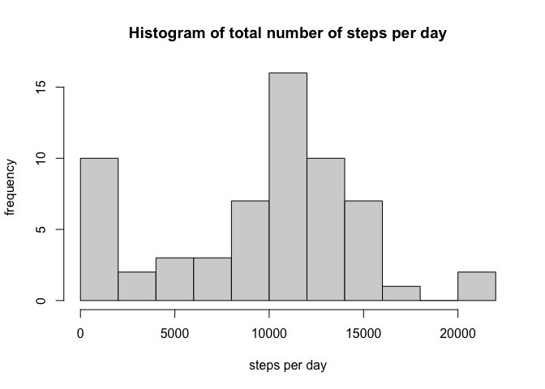
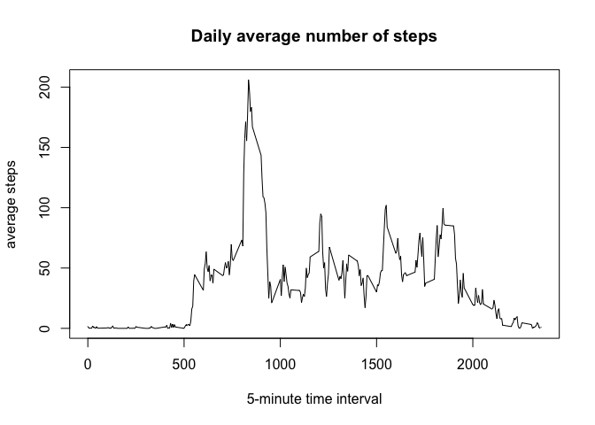
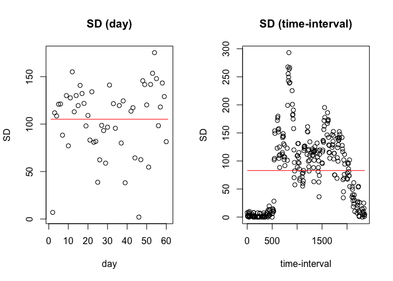
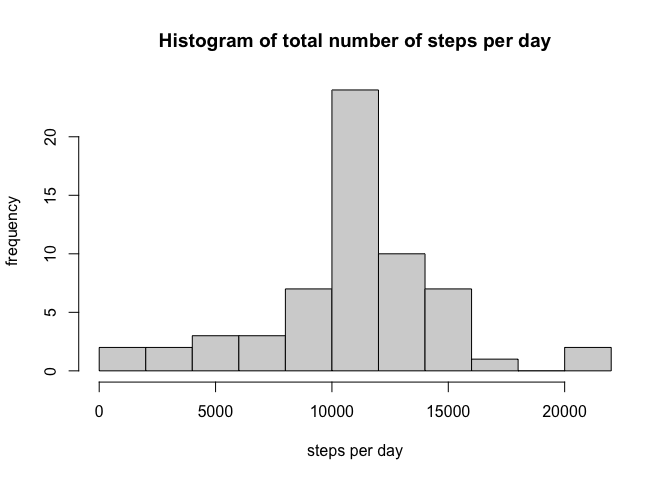
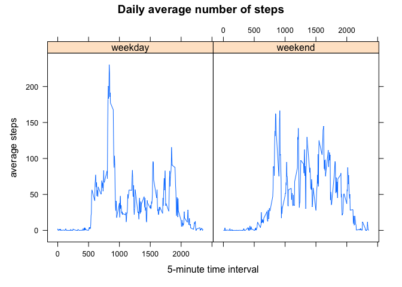

This projects investigates the daily activity (i.e., steps taken) of an individual in order to answer a number of related questions.
## Loading and preprocessing the data
In this section, I load the data and the necessary packages.

```r
library(dplyr)
library(lattice)
data <- read.csv('activity.csv')
```


## What is mean total number of steps taken per day?
In this section, I investigate the distribution of daily steps the user takes. First, I plot a histogram to look at the distribution of daily steps. Afterward, I find the mean and median. 

```r
data_day <- group_by(data,date)
data_day <- summarize(data_day,steps=sum(steps,na.rm=TRUE))
hist(data_day$steps,xlab='steps per day',ylab='frequency',main='Histogram of total number of steps per day',breaks=10)
```

<!-- -->

```r
median(data_day$steps)
```

```
## [1] 10395
```

```r
mean(data_day$steps)
```

```
## [1] 9354.23
```

## What is the average daily activity pattern?
In this section, I investigate the average number of steps the user takes at a certain time during the day. First, I plot this average number across each 5-minute interval. Second, I find in what time of the day the user takes the most number of steps on average.

```r
data_minute <- group_by(data,interval)
data_minute <- summarize(data_minute,steps=mean(steps,na.rm=TRUE))
plot(data_minute$interval,data_minute$steps,type="l",xlab='5-minute time interval',ylab='average steps',main='Daily average number of steps')
```

<!-- -->

```r
which.max(data_minute$steps)
```

```
## [1] 104
```

## Imputing missing values
In this section, I provide a solution to solve the issue of missing values in the **steps** variable.

First, we find the total number of missing values in the dataset.

```r
nrow(data[is.na(data$steps),])
```

```
## [1] 2304
```

Now, I address the issue of missing values by replacing these values with the average steps in that 5-minute interval across all days. There are two reasons to follow this solution (compared to daily average). First, there are days in which the number of steps are missing across all time-inverals. As a result, the daily average solution will not work for such missing values. Furtheremore, in days with many missing values, replacing them with daily average disregards the daily variation that clearly exists in the data and is in accordance with an individual behavior due to changing activities (e.g. sleep, work, etc.) throughout the day. Following this interpretation, one can also assume that individuals have a more stable pattern in their daily behavior (due to external factors such as jobs, hours of sleep) that makes the variation across days for each time interval less substantial. Finally, to empirically test this assumption, I compare the variation and mean of the SD (standard deviation) for each time-interval throughout the days with the variation and mean of SD for each day. As we can see from the plots below, the average of variation across time-intervals is significantly lower compared to the alternative. Ultimately, I suggest the better solution to distinguish between weekend and weekdays when we are replacing the missing value with the average of that time-interval.

```r
data_day_temp <- group_by(data,date)
data_day_temp <- summarize(data_day_temp,sd=sd(steps,na.rm=TRUE))
data_minute_temp <- group_by(data,interval)
data_minute_temp <- summarize(data_minute_temp,sd=sd(steps,na.rm=TRUE))
par(mfrow=c(1,2))
data_day_temp$mean_t <- mean(data_day_temp$sd,na.rm=TRUE)
plot(1:nrow(data_day_temp),data_day_temp$sd,xlab='day',ylab='SD',main='SD (day)')
points(1:nrow(data_day_temp),data_day_temp$mean_t,type="l",col='red')

data_minute_temp$mean_t <- mean(data_minute_temp$sd,na.rm=TRUE)
plot(data_minute_temp$interval,data_minute_temp$sd,xlab='time-interval',ylab='SD',main='SD (time-interval)')
points(data_minute_temp$interval,data_minute_temp$mean_t,type="l",col='red')
```

<!-- -->

Below, I implement the solution detailed above. Then, I plot the histogram and find the new mean and median. According to the results, imputing the missing data increases mean and median resulting in an increase in the estimated daily number of steps.


```r
data_2 <- data
na_count <- is.na(data$steps)
for (i in seq_len(nrow(data_2))){
  if(na_count[i]){
    data_2$steps[i]<-mean(data[data$interval==data_2$interval[i],]$steps,na.rm=TRUE)
  }
}
data_day_2 <- group_by(data_2,date)
data_day_2 <- summarize(data_day_2,steps=sum(steps,na.rm=TRUE))
hist(data_day_2$steps,xlab='steps per day',ylab='frequency',main='Histogram of total number of steps per day',breaks=10)  
```

<!-- -->

```r
median(data_day_2$steps)
```

```
## [1] 10766.19
```

```r
mean(data_day_2$steps)
```

```
## [1] 10766.19
```


## Are there differences in activity patterns between weekdays and weekends?
Finally, in this section, I again investigate the average number of steps the user takes at a certain time during the day while distinguishing between weekdays and weekend.


```r
data_2$datee<-as.POSIXlt(data_2$date)
data_2$weekday<-weekdays(data_2$datee)
data_2$weekend<-ifelse(data_2$weekday=="Saturday" | data_2$weekday=="Sunday","weekend","weekday")
data_2$weekend <- factor(data_2$weekend)

data_minute_2 <- group_by(data_2,across(all_of(c("interval","weekend"))))
data_minute_2 <- summarize(data_minute_2,steps=mean(steps,na.rm=TRUE))
xyplot(steps~interval|weekend,data=data_minute_2,type="l",xlab='5-minute time interval',ylab='average steps',main='Daily average number of steps')
```

<!-- -->

